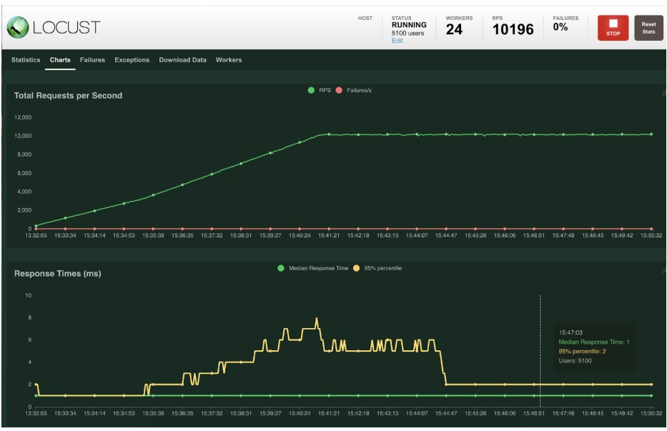

## Generating MongoDB workloads using Locust

[Locust](https://locust.io/) is an easy to use, scriptable and scalable performance testing tool written
in Python. It allows you to easily code up the MongoDB operations in pure Python and visualise their
execution in a browser by plotting the number of requests per second and p50 and p95 latencies in real
time.



Locust can run on a laptop in standalone mode. It requires almost no configuration and is easy to get
started with. When required however, Locus can be run in a distributed mode - with a single primary that
aggregates and exposes the stats and multiple workers that can drive thousands of queries per second
against your MongoDB deployments.

This is a basic template that can be extended to build a custom workload. It contains the boilerplate code
that is needed to get started. Sample functions to insert new documents (single and bulk), run finds
and aggregation pipelines are also implemented for reference.

To get started you should have python 3 abd git installed. On Amazon Linux 2 this can be done using the
following commands:

```shell
sudo yum install git -y
sudo yum install python3 -y
```

Please clone this repository, create the virtual environment and install the prerequisites using the
following commands:

```shell
git clone https://github.com/sabyadi/mongolocust
cd mongolocust
python3 -m venv venv
source venv/bin/activate
pip install -r requirements.txt
```

Once the requirements are installed, you need to update the cluster credentials in the
[settings.py](settings.py) to match your MongoDB deployment and copy over your modified [load_test.py](load_test.py).

The test can be started locally in standalone mode using the following command:

```shell
(locust) adilet@MBP16 mongolocust % locust -f load_test.py
[2021-08-15 20:33:45,238] MBP16.local/INFO/locust.main: Starting web interface at http://0.0.0.0:8089 (accepting connections from all network interfaces)
[2021-08-15 20:33:45,247] MBP16.local/INFO/locust.main: Starting Locust 2.1.0
```

Finally, you can open the browser and navigate to [http://127.0.0.1:8089](http://127.0.0.1:8089) to start the test.

## Running Locust in distributed mode

Locust can be run in a distributed mode, where the primary instance controls the workload, exposes a client GUI and
gathers the stats from multiple worker instances executing the tests. This mode is required to generate higher
throughput. The primary and workers can be placed within the same cloud provider region as the Atlas cluster to
minimize the network latencies.

The steps required to run the primary instance:

```shell
sudo yum install git -y
sudo yum install python3 -y
git clone https://github.com/sabyadi/mongolocust
cd mongolocust
python3 -m venv venv
source venv/bin/activate
pip install -r requirements.txt
```

The right workload file needs to be copied over and the connection string needs to be modified in
[settings.py](settings.py).

Finally, the primary instance can be started as follows:

```shell
./run_distributed_primary.sh
```

Please note the primary's IP address since it will be required to access the GUI as well as to configure
workers. The workers use the same default TCP port of 8089 to establish a connection to primary.

The steps required to run a worker (can be repeated multiple time on multiple VMs):

```shell
sudo yum install git -y
sudo yum install python3 -y
git clone https://github.com/sabyadi/mongolocust
cd mongolocust
python3 -m venv venv
source venv/bin/activate
pip install -r requirements.txt
```

The worker instances can be stared using the following command (the <PRIMARY_HOST_IP> needs to be replaced with
the right IP address from the previous step):

```shell
./run_distributed_worker.sh <PRIMARY_HOST_IP>
```

You can run multiple instances of the worker on every machine, since the workers are single threaded. Multiple
machines can be used to run the workers.

## Automated deployment via Terraform

[Terraform](https://www.terraform.io/) is an open-source tool to manage the entire lifecycle of infrastructure using infrastructure as code.
The folder [terraform](terraform) contains a set of configuration files which will deploy an Atlas Cluster, database user and a private endpoint on AWS as well as a Locust master and custom amount of workers on AWS.
The complete deployment process will take around 10 minutes.
Please refer to the [README.md](terraform/README.md) in the [terraform](terraform) folder for details.

## Running distributed locust in kubernetes

Distributed locust can be executed in kubernetes environments. Using kubernetes allows for simple worker scalability in
the distributed mode. Please refer to the [README.md](k8s/README.md) in the [k8s](k8s) folder for details.

## Debugging the workload

It is possible to debug locust workloads. The [main.py](main.py) contains the code required to run the
workload generation under the python interpreter. Gevent compatibility should be enabled in your
favourite IDE debugger (feature supported both in Pycharm and VSCode) for this to work.
